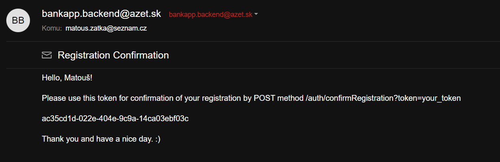
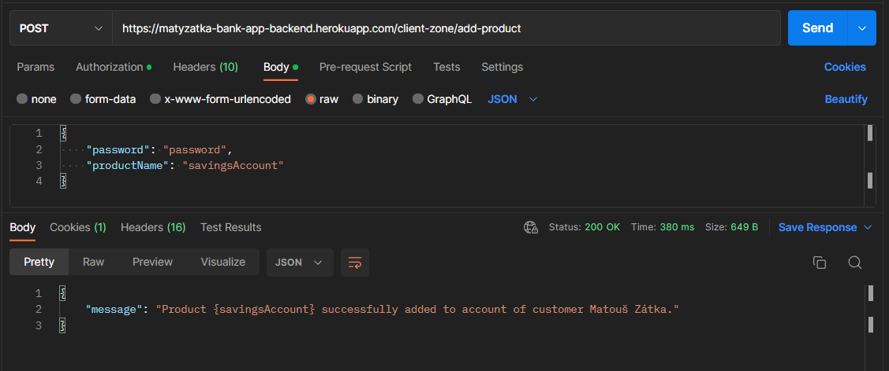
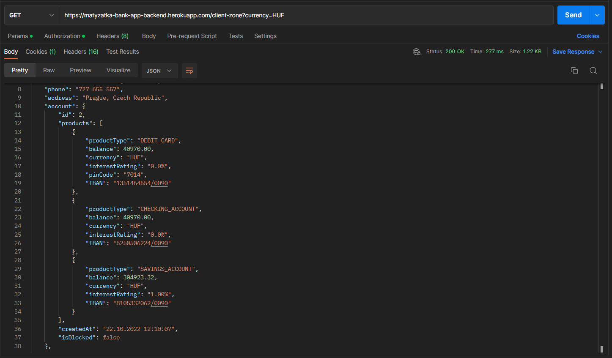

[](https://github.com/matyzatka/BankAppBackend/actions/workflows/workflow.yml)

# Banking application - Backend

A free-time project trying to simulate a banking application, with basic security using JWT, providing customer account
management, including related financial products and simple, but secure transactions.

The application communicates through REST endpoints and offers an API, used
to manage user accounts by authorized person. <br>There is an option to register for new
clients and existing clients can use login. JWT is used to enter the client zone, and allows viewing the client's
data, changing personal information, establishing or canceling a financial product (such as a savings account or credit
card) or sending money from your account to another. Actual currency values are provided by Retrofit calls.
The possibility of depositing or withdrawing cash is a matter of course, but that was only the beginning.

## Table of Contents

- [Used technologies](#used-technologies)
- [Features](#features)
- [How to use app](#how-to-use-app)
- [Demo](#demo)

## Used technologies

- **Project**: Java 18, Spring Boot 2.7.3, Gradle 7.4
- **Security**: Spring Security, OAuth JWT
- **Persistence**: Spring JPA, MySQL, H2, Hibernate
- **Logging**: Logback/Sl4fj
- **Testing**: JUnit 5, MockMvc, Awaitility, Spring Security Test, Jacoco
- **Other**: Spring Validation, Spring Mail, Lombok, Retrofit, Dotenv
- **CI**: Checkstyle, Build and Tests - GitHub Actions
- **CD**: Heroku Cloud with JawsDB

## Features

- Secured endpoints
- Secured HTTP headers
- Password encryption
- JWT token used for authorization, using role-based authentication for Customer API
- Registration, Login, Confirm registration by email
- **Customer**: is enabled after confirmation of registration, personal info accessible only to admin or customer
  himself, can have roles USER, ADMIN
- **Customer's Account**: has list of financial products, can be blocked/unblocked (disables ATM + client-zone endpoints
  except "/unblock")
- **Products**: by default in EUR, unique IBAN, can have interest rates, cards are secured by PIN code, balance held
  by BigDecimal
    - Checking account
        - is present in account by default
        - is synchronized with debit card
    - Debit Card
        - is present in account by default
        - is synchronized with checking account
    - Savings Account
        - periodically increases amount of saved money, depending on the value of interest rate (each 10 seconds)
    - Credit Card
        - can be used only for payments, not working with ATM

- **Client-zone**: only for JWT authorized customers, offers several options for checking and managing client's data and
  products.

    - show all customer personal data and products (possible in 100+ currencies with actual rates)
    - update customers personal data
    - make a transaction
    - show transaction history
    - block/unblock customer account
    - delete customer account
    - add a product to customer's account
    - delete a product from account

- **Customer API**: provides basic operations with customers to admins
    - show all customers and their personal data + products
    - get customer
    - update customer
    - delete customer

- **ATM**: works only with debit cards, requires valid PIN code
    - deposit cash: customer can deposit money to whichever product he owns
    - withdraw cash: handles insufficient funds

- **Custom Exceptions**: the majority of exceptions is handled by CustomExceptionHandler, displaying human-friendly messages

## How to use app

- via Postman or any HTTP Client (recommended)
- with CURL commands in CLI


- URL: https://matyzatka-bank-app-backend.herokuapp.com


- ### **Sign up**:
    - POST
    - `/auth/signup`
    - required body:

      ```json
      {
      "username": "your_username",
      "password": "your_password",
      "firstName": "your_FirstName",
      "lastName": "your_LastName",
      "dateOfBirth": "DD-MM-YYYY",
      "email": "your@email.com",
      "phone": "???-???-???",
      "address": "Your Address, 123"
      }
      ```
    - If request was successful, please check your email for confirmation token and follow the instructions.


- ### **Confirm Registration**

    - POST
    - `/auth/confirmRegistration?token=your_token`
    - If request was successful, customer account is enabled.


- ### **Login**

    - POST
    - /auth/login
    - required body:
   ```json
    {
    "username": "your_username",
    "password": "your_password"
    }
    ```

    - you can also try out already existing admin account by providing following credentials:
   ```json
    {
    "username": "admin",
    "password": "password"
    }
    ``` 

- ### **Customer API** (requires **admin** role, valid JWT in Authorization header)

    - **Show all customers:**

        - GET
        - `/api/v1/customers/all`

    - **Get customer by ID:**

        - GET
        - `/api/v1/customers/{id}`

    - **Update customer by ID:**

        - PUT 
        - `/api/v1/customers/{id}`
        - required body must contain all values, so it is recommended to copy the original one in GET endpoint and modify only those values, you wish to change

    - **Delete customer by ID:**
  
        - DELETE
        - `/api/v1/customers/{id}`
      

- ### **ATM** (requires debit card IBAN, PIN code and amount of money)

    - required body:

   ```json
    {
      "iban": "0227567335/0090",
      "pinCode": "1234",
      "amount": 500
    }
    ```
  - **Deposit:** 
  
    - POST
    - `/atm/deposit`
    
  - **Withdraw:**
    - POST
    - `/atm/withdraw`


- ### **Client Zone** (requires valid JWT in Authorization header)

    - **Show customer data**
    
      - GET
      - `/client-zone`
      - optional: `/client-zone?currency=CZK` supports more than 100 currencies
    
        - products balances are converted into chosen currency with actual rates
        
    - **Transaction history**
    
        - GET
        - `/client-zone/history`

    - **Make a transaction**

        - POST
        - `/client-zone/pay`
        - required body:
      
    ```json
    {
    "sendingIban": "4735240525/0090",
    "receivingIban": "5731021542/0090",
    "amount": 250
    }
    ```

    - **Update customer data**

        - PUT
        - `/client-zone/update`
        - required body must contain all values, so it is recommended to copy the original one in GET endpoint and modify only those values, you wish to change

    - **Block Customer Account**

        - POST
        - `/client-zone/block`
        - disables all functionality in customer's account
        - required body:
    ```json
    {
    "password": "your_password"
    }
    ```

  - **Unblock Customer Account**

      - POST
      - `/client-zone/unblock`
      - enables all functionality in customer's account
    - required body:
  ```json
    {
    "password": "your_password"
    }
    ```

  - **Delete Customer Account** 
    
    - DELETE
    - `/client-zone/delete`
    - required body:
  ```json
    {
    "password": "your_password"
    }
    ```
  
  - **Add product**

    - POST
    - `/client-zone/add-product`
    - supported product names: **savingsAccount** or **creditCard**
    - required body:
  ```json
    { 
    "productName": "savingsAccount",
    "password": "password"
    }
    ```    

  - **Delete product**

      - DELETE
      - `/client-zone/delete-product`
      - product is identified by IBAN
      - required body:
  ```json
    { 
    "iban": "4984651321/0903",
    "password": "your_password"
    }
    ```

## Demo

- ### Sign-up


- ### Confirm Registration




- ### Login


- ### Client Zone


- ### Deposit Cash


- ### Add savings account



- ### Send money from your checking account to savings account


- ### Transaction history


- ### Show actual balances in HUF


